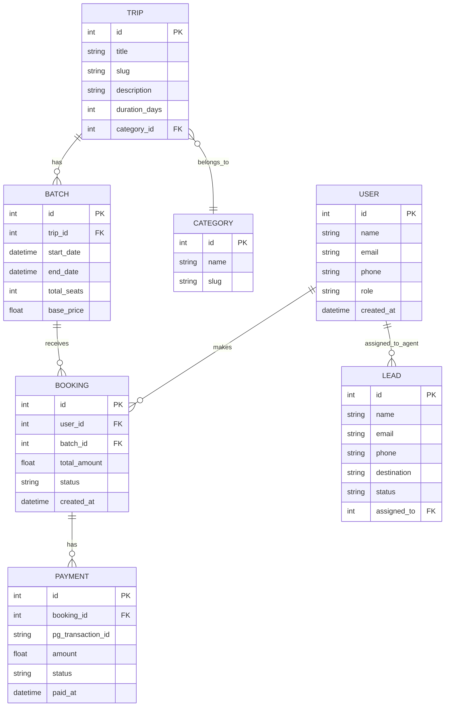

# 🌍 Next-Gen Travel Platform (Inspired by WanderOn) - Implementation Blueprint

## Part 1: Comprehensive Platform Analysis

### 1. Website Structure
The modern travel platform requires a hierarchical, conversion-optimized structure:
- **Home:** Hero section with search/filtering, trending trips, categories, testimonials, and SEO content.
- **Destinations:** Domestic, International, Weekend Getaways, Backpacking Trips.
- **Trip Details (PDP):** Itinerary, inclusions/exclusions, pricing, batch dates, gallery, FAQs, reviews.
- **About/Company:** Story, team, careers, contact us.
- **Content:** Blog, travel guides, photo journals.
- **User Portal:** Profile, past/upcoming trips, payments, support.

### 2. Navigation Hierarchy
- **Primary Navbar:** Destinations (Mega Menu), Trip Styles (Weekend, Backpacking, Custom), Corporate, Blog, Login/Signup.
- **Secondary Navbar (Sticky):** On trip detail pages, links to Itinerary, Inclusions, Cost, Dates, Book Now button.
- **Footer Navigation:** Quick links, policies (terms, refund, privacy), social links, newsletter signup, contact info.

### 3. All Pages
- **Public:** Home, Destination Listing, Trip Detail, Search Results, About Us, Contact, Blog Listing, Blog Post, FAQs, T&C, Privacy Policy, Career.
- **User Dashboard:** Profile, Bookings, Wishlist, Payments, Reviews.
- **Admin/Vendor:** Dashboard, Trip Management, Batch Management, Lead CRM, Booking Management, Content Management (CMS), Analytics, Settings.

### 4. Every Feature
- **Search & Filter:** By destination, month, trip style, budget, duration.
- **Booking Engine:** Real-time seat availability, batch selection, partial/full payment, promo codes.
- **Customized Trip Builder:** Form-based lead capture for tailored itineraries.
- **User Reviews & Ratings:** Verified booking reviews, photo uploads.
- **Wishlisting:** Save favorite trips.
- **Refer & Earn:** Affiliate/loyalty program for users.
- **Automated Communication:** Email/SMS/WhatsApp for booking confirmation, itinerary drops, payment reminders.

### 5. User Journeys
- **Discovery -> Booking:** Landing page -> Filter trips -> View details -> Select Batch -> Pay Advance -> Confirmation.
- **Custom Trip:** Landing page -> Custom Trips -> Fill Form -> Sales team contact -> Custom Itinerary generation -> Payment.
- **Post-Booking:** Login -> Dashboard -> View Trip Details -> Make Remaining Payment -> Download Tickets/Vouchers -> Leave Review Post-Trip.

### 6. Admin Functionalities
- **Catalog Management:** Create/edit trips, manage itineraries, SEO tags.
- **Batch & Inventory Management:** Create dates, set total seats, dynamic pricing.
- **Order/Booking Management:** View bookings, manage cancellations/refunds, manual payment updates.
- **CRM/Lead Management:** Pipeline for custom trip queries, follow-up reminders.
- **Blog & Content CMS:** WYSIWYG editor for SEO blogs.
- **User Management:** Ban, verify, update user roles.
- **Reporting:** Revenue, occupancy rates, lead conversion rates.

### 7. Booking Workflow
1. User selects a batch (date) on the Trip Details Page.
2. Selects room sharing preference (Double, Triple, Quad).
3. Adds add-ons (flights, extra activities).
4. System calculates final price.
5. User authenticates (OTP/Email).
6. Enters traveler details.
7. Redirects to Payment Gateway (Razorpay/Stripe).
8. Payment Success -> Webhook updates DB -> Booking Confirmed.
9. Invoice and Itinerary sent via Email/WhatsApp.

### 8. Lead Generation Workflow
- Pop-ups offering travel guides in exchange for email.
- "Request a Callback" floating CTA.
- Detailed multi-step form for "Customized Trips" (destination, group size, dates, budget).
- Leads drop into Admin CRM.
- Automated email sequence triggered.
- Sales agent assigned -> Follow-up -> Status changed to Converted/Lost.

### 9. Blog Architecture
- **Categories:** Destinations, Tips & Tricks, Travel Stories.
- **Structure:** Author bio, publish date, reading time, table of contents, high-quality images.
- **Conversion hooks:** Embedded trip cards within relevant blog posts (e.g., "Trips to Spiti" in a Spiti blog).
- **SEO:** Canonical tags, rich snippets (Article schema), lazy loading images.

### 10. SEO Implementation
- **Technical SEO:** Server-Side Rendering (SSR) via Next.js, Sitemap.xml, robots.txt, optimized Core Web Vitals.
- **On-Page SEO:** Dynamic meta titles/descriptions, structured data (Product, Breadcrumb, Review, Organization schema).
- **Content:** Location-based landing pages (e.g., "Best Backpacking Trips in Himachal").
- **URLs:** Clean, descriptive slugs (`/trips/spiti-valley-backpacking`).

### 11. Authentication
- **User Auth:** Passwordless login via OTP (SMS/WhatsApp) or Social Login (Google, Apple).
- **Admin Auth:** Role-Based Access Control (RBAC) with JWT or Session based auth, plus 2FA for sensitive operations.

### 12. Trip Management System
- **Core Entities:** `Trip` (Base definition) -> `Itinerary` (Day-wise) -> `Batch` (Specific dates & pricing).
- **Dynamic Pricing:** Ability to change prices based on demand/season.
- **Inventory Lock:** Temporarily hold seats for 10 minutes while user completes payment.

### 13. AI Itinerary Builder Possibilities
- **Future Integration:** Use LLMs to generate personalized day-by-day itineraries based on user inputs (budget, vibe, duration, location).
- **Dynamic Packaging:** Suggest hotels, flights, and activities algorithmically.
- **AI Chatbot:** "Travel Guru" for instant 24/7 destination queries and lead capture.

### 14. Required Database Schema (High-Level)
- `Users` (id, name, email, phone, role)
- `Trips` (id, title, slug, duration, difficulty, category_id)
- `TripBatches` (id, trip_id, start_date, end_date, total_seats, available_seats, price)
- `Bookings` (id, user_id, batch_id, total_amount, amount_paid, status)
- `Payments` (id, booking_id, transaction_id, amount, status, gateway)
- `Leads` (id, name, phone, destination, status, assigned_to)
- `Reviews` (id, trip_id, user_id, rating, comment)

### 15. REST API Design
- `GET /api/v1/trips` - List trips (with filters/pagination)
- `GET /api/v1/trips/:slug` - Trip details
- `GET /api/v1/trips/:id/batches` - Available batches
- `POST /api/v1/bookings` - Create booking
- `POST /api/v1/payments/webhook` - PG integration
- `POST /api/v1/leads` - Submit lead form

### 16. Folder Architecture (Monorepo - Turborepo)
```
/apps
  /web (Next.js - Public facing site)
  /admin (React/Vite - Dashboard)
  /api (Node.js/Express or NestJS)
/packages
  /ui (Shared components)
  /database (Prisma schema & client)
  /config (ESLint, Prettier, TS configs)
```

### 17. Tech Stack Recommendations
- **Frontend:** Next.js (App Router) for SEO & performance, Tailwind CSS for styling, Zustand for state management.
- **Backend:** Node.js with NestJS (for scalable architecture) or Express.
- **Database:** PostgreSQL (Relational integrity for bookings/payments).
- **ORM:** Prisma or Drizzle.
- **Caching:** Redis (for session management, trip catalog caching).
- **Cloud/Hosting:** AWS (EC2/ECS for API, Vercel/CloudFront for Frontend, S3 for images).
- **Payment Gateway:** Razorpay, Stripe, or Cashfree.

### 18. Third-Party Integrations
- **Communications:** Twilio (SMS), SendGrid/Resend (Email), Interakt/Wati (WhatsApp API).
- **Payments:** Razorpay.
- **Analytics:** Google Analytics 4, Mixpanel, Hotjar (Session recording).
- **Customer Support:** Freshdesk or Intercom.

### 19. Dashboard Modules
- **Overview:** Revenue graphs, upcoming batches, pending leads.
- **Catalog:** Trip and batch CRUD.
- **Sales CRM:** Kanban board for lead management.
- **Bookings:** Detailed booking views, manual override capabilities.
- **Marketing:** Promo code generation, banner management.

### 20. User Roles
- **Super Admin:** Full access.
- **Sales Agent:** Access to Leads and Bookings only.
- **Operations:** Access to Batches, Bookings, Trip Management.
- **Content Writer:** Access to CMS/Blog only.
- **Customer:** Front-end user.

### 21. CMS Requirements
- Headless CMS (Strapi, Sanity) or custom-built CMS integrated into the Admin panel.
- Needs media library, markdown/rich text support, SEO meta fields.

### 22. Performance Optimizations
- Edge caching (Cloudflare).
- Image optimization (Next/Image, WebP format).
- Database indexing on search columns (`destination`, `dates`).
- Code splitting & Lazy Loading for heavy components (e.g., Maps).

### 23. Security Considerations
- Rate limiting on API (prevent DDoS & brute force).
- Input validation & sanitization (prevent SQLi, XSS) via Zod.
- CORS policies.
- Secure HTTP-only cookies for JWTs.
- Idempotency keys for payment processing to prevent double charges.

### 24. Responsive Design Strategy
- Mobile-first approach using Tailwind.
- Sticky bottom bars on mobile for "Book Now".
- Horizontal scrollable cards for trip variations to save vertical space.

### 25. Future Scalability
- Microservices architecture (if expanding globally).
- Multi-currency & multi-language support.
- B2B portal for travel agents to book on behalf of clients.

### 26. Missing Features (Modern Improvements)
- **Virtual Tours/Video Previews:** Short Reels-like videos for trips instead of static images.
- **Community Forum:** A Reddit-like space for travelers to discuss upcoming trips and find travel buddies.
- **Gamification:** Badges and points for miles traveled.
- **Live Seat Map:** Showing exactly which seats in the traveler van/bus are available.

---

## Part 2: Software Requirement Specification (SRS)

### 1. Introduction
**Purpose:** To define the functional and non-functional requirements for the Next-Gen Travel Platform.
**Scope:** The platform will facilitate discovery, booking, and management of group travel, custom itineraries, and backpacking trips.

### 2. Functional Requirements
- **FR1:** The system shall allow users to search for trips by location, month, and trip type.
- **FR2:** The system shall display real-time availability of seats for specific trip batches.
- **FR3:** Users shall be able to book a trip by paying an advance or full amount.
- **FR4:** The system shall automatically send a booking confirmation via Email and WhatsApp.
- **FR5:** Admins shall be able to create, read, update, and delete trips and itineraries.
- **FR6:** The system shall capture leads from custom trip forms and assign them to sales agents.

### 3. Non-Functional Requirements
- **Performance:** Page load time should be < 1.5 seconds. LCP < 2.5s.
- **Scalability:** System must handle 10,000 concurrent users during flash sales.
- **Security:** All user data must be encrypted at rest and in transit (TLS 1.3). Payment data must not be stored on our servers (PCI-DSS compliance handled by PG).
- **Availability:** 99.9% uptime SLA.

---

## Part 3: Product Requirement Document (PRD)

### 1. Objective
To launch a robust, conversion-optimized travel platform that reduces manual operational overhead for bookings by 80% and increases organic traffic by 50% through SEO-driven architecture.

### 2. Target Audience
- Millennials and Gen-Z seeking hassle-free group travel.
- Corporate teams looking for offsites.
- Couples looking for customized honeymoon packages.

### 3. User Stories
- *As a User*, I want to filter trips by long weekends so I can maximize my holidays.
- *As a User*, I want to see the detailed day-by-day itinerary with pictures so I know what to expect.
- *As an Admin*, I want to generate dynamic payment links for custom trips so users can pay partial amounts.
- *As a Sales Agent*, I want to see a Kanban board of my leads so I can follow up efficiently.

### 4. Key Metrics (KPIs)
- Conversion Rate (Lead to Booking).
- Customer Acquisition Cost (CAC).
- Monthly Active Users (MAU).
- Gross Merchandise Value (GMV).

---

## Part 4: ER Diagram



---

## Part 5: API Documentation (Sample Endpoints)

### `GET /api/v1/trips`
**Query Params:** `category`, `month`, `limit`, `page`
**Response:**
```json
{
  "success": true,
  "data": [
    {
      "id": 1,
      "title": "Spiti Valley Backpacking",
      "slug": "spiti-valley-backpacking",
      "duration": "6N/7D",
      "starting_price": 14500,
      "thumbnail": "https://s3.../img.jpg"
    }
  ],
  "meta": { "total": 45, "page": 1 }
}
```

### `POST /api/v1/bookings/initiate`
**Body:**
```json
{
  "batch_id": 102,
  "travelers_count": 2,
  "amount_to_pay": 5000,
  "payment_type": "advance"
}
```
**Response:**
```json
{
  "success": true,
  "booking_id": 9821,
  "pg_order_id": "order_Kw3...",
  "status": "pending_payment"
}
```

---

## Part 6: Database Design (PostgreSQL schema snippet)

```sql
CREATE TABLE users (
    id SERIAL PRIMARY KEY,
    name VARCHAR(255) NOT NULL,
    email VARCHAR(255) UNIQUE NOT NULL,
    password_hash VARCHAR(255),
    phone VARCHAR(20),
    role VARCHAR(50) DEFAULT 'customer',
    created_at TIMESTAMP DEFAULT CURRENT_TIMESTAMP
);

CREATE TABLE trips (
    id SERIAL PRIMARY KEY,
    title VARCHAR(255) NOT NULL,
    slug VARCHAR(255) UNIQUE NOT NULL,
    overview TEXT,
    duration_days INT,
    created_at TIMESTAMP DEFAULT CURRENT_TIMESTAMP
);

CREATE TABLE batches (
    id SERIAL PRIMARY KEY,
    trip_id INT REFERENCES trips(id) ON DELETE CASCADE,
    start_date DATE NOT NULL,
    end_date DATE NOT NULL,
    total_seats INT NOT NULL,
    price DECIMAL(10, 2) NOT NULL
);
```

---

## Part 7: Component List (Frontend React/Next.js)

### Common/UI
- `Button`, `Input`, `Modal`, `Toast`, `Spinner`, `Card`
- `Navbar`, `Footer`, `Sidebar` (Admin)

### Marketing Pages
- `HeroBanner`, `TrendingTripsCarousel`, `TestimonialSlider`, `FeatureList`, `NewsletterSubscribe`

### Trip Details
- `ImageGallery`, `ItineraryTimeline`, `InclusionsExclusionsCard`, `BatchSelectorModal`, `PricingCalculator`, `ReviewList`

### Booking Flow
- `TravelerDetailsForm`, `OrderSummary`, `PaymentGatewayWrapper`, `BookingSuccessInvoice`

### Dashboard
- `StatCard`, `DataTable`, `BookingStatusBadge`, `LeadKanbanBoard`, `RichTextEditor`

---

## Part 8: Sprint Plan (2-Week Sprints)

- **Sprint 1: Foundation & Auth**
  - Setup Turborepo, Next.js, NestJS, PostgreSQL.
  - Implement User and Admin Authentication (JWT, OTP).
  - Setup CI/CD pipelines (GitHub Actions -> Vercel/AWS).
- **Sprint 2: Catalog & CMS**
  - DB Schema for Trips, Categories, and Itineraries.
  - Admin UI for CRUD operations on Trips.
  - Public facing Trip Listing and Search API.
- **Sprint 3: Batches & Booking Engine**
  - DB Schema for Batches and Pricing.
  - Integration of Payment Gateway (Razorpay).
  - Booking checkout flow and order generation.
- **Sprint 4: CRM, User Dashboard & Polish**
  - Custom lead form and Admin Kanban board.
  - User profile and booking history UI.
  - Automated Email/WhatsApp notifications.
  - SEO implementations and Core Web Vitals optimization.

---

## Part 9: 30-Day Development Roadmap

| Days | Phase | Key Deliverables |
|---|---|---|
| Day 1-5 | Planning & Setup | Tech stack initialization, DB schema finalized, Figma designs handed off. |
| Day 6-12 | Backend APIs | Auth, Trip Management, Batch processing APIs complete. |
| Day 13-18 | Frontend Core | Home page, Trip listing, Trip details UI integrated with APIs. |
| Day 19-23 | Checkout Flow | Payment gateway integration, booking generation, validation logic. |
| Day 24-27 | Admin Panel | CRM, Booking Management, Content management operational. |
| Day 28-30 | Testing & Launch | UAT, Load testing, bug squashing, production deployment. |

---

## Part 10: Phase-wise Implementation Plan

### Phase 1: MVP (Minimum Viable Product)
- Focus: Basic trip listing, manual lead capture, static pricing.
- Goal: Validate demand, get the site live quickly.
- Timeline: Weeks 1-4.

### Phase 2: Booking Engine & Automation
- Focus: Real-time availability, direct online payments, user dashboards, automated emails.
- Goal: Reduce manual sales effort, scale booking volume.
- Timeline: Weeks 5-8.

### Phase 3: CRM & Content Scaling
- Focus: Internal Kanban for leads, integrated Blog CMS, advanced SEO tools.
- Goal: Improve conversion rates of custom inquiries, increase organic traffic.
- Timeline: Weeks 9-12.

### Phase 4: Modern Intelligence (The "Next-Gen" Step)
- Focus: AI Itinerary builder, Gamification, dynamic pricing algorithms.
- Goal: Differentiate from competitors, establish tech supremacy.
- Timeline: Month 4 onwards.
